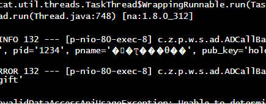
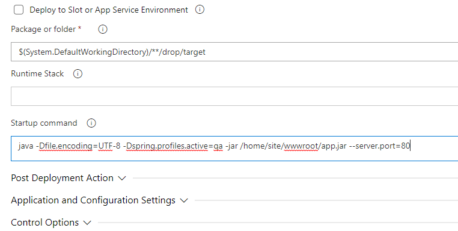

로그스트림에서 모니터링시 한글이 깨진다.

직접적으로 관련있는 것은 아니지만, 이 [가이드 문서](https://docs.microsoft.com/en-us/azure/app-service/configure-language-java?pivots=platform-linux#set-default-character-encoding)를 보면 기본 문자 인코딩셋이 UTF-8 이 아닌것으로 보인다. (MS 니깐 윈도우 기반인듯)

따라서 아래처럼 자바 런타임 환경변수로 UTF-8 인코딩 셋을 적용해주었다

